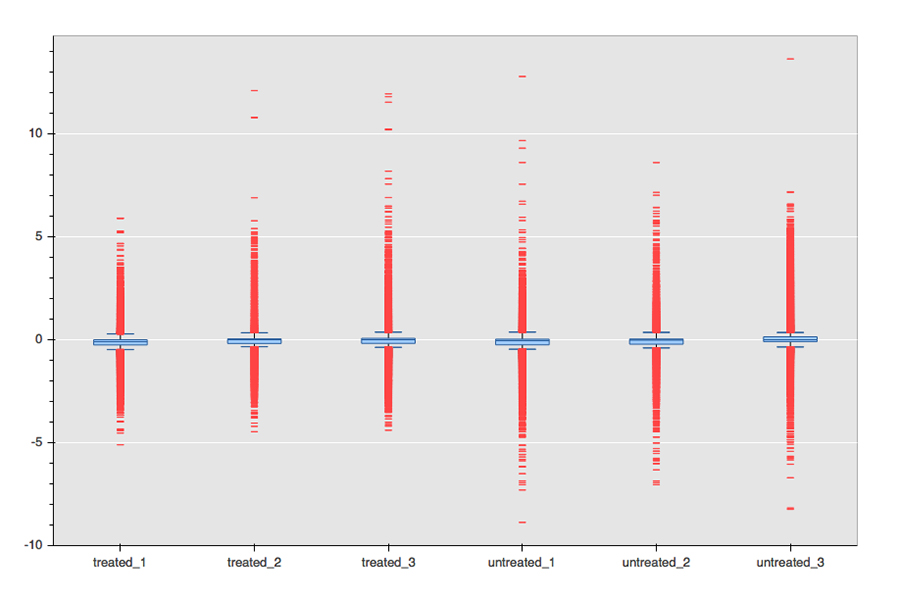

# Dots

[](https://travis-ci.org/sandyjmacdonald/dots_for_microarrays)

Dots is a Python package for working with microarray data. 
Its back-end is a standalone package for reading in, normalisation, statistical 
analysis and plotting of Agilent single-colour microarray data. Its front-end
isn't finished yet (more on that below).

## Installation

**UPDATE:** Dots is now on PyPi! You can install it as follows:

```
sudo pip install dots_for_microarrays
```

**OR, ALTERNATIVELY:**

Dots has a number of dependencies including NumPy and SciPy and the least painful
way of getting these is to use the 
[Anaconda Python distribution](https://store.continuum.io/cshop/anaconda/) which includes
NumPy and SciPy and a couple of the other required dependencies like Pandas, Scikit-learn
and Bokeh.

Once you've downloaded and installed Anaconda, you can install the Dots package as follows:

```
git clone https://github.com/sandyjmacdonald/dots_for_microarrays
cd dots_for_microarrays
sudo python setup.py install
```

Setuptools should take care of the dependencies but, in testing, I've found the NumPy, SciPy
and Scikit-learn installations to be problematic, hence my recommendation of using Anaconda
to relieve those headaches.

Once you have Anaconda, if you'd like to install and use Dots in a fenced-off virtual 
environment that won't interfere with anything else, then you can do so as follows:

```
conda create --yes -n dots_env python=2.7
source activate dots_env

git clone https://github.com/sandyjmacdonald/dots_for_microarrays
cd dots_for_microarrays
sudo python setup.py install
```

To test that the installation has worked, you can run Nosetests as follows:

```
sudo python setup.py nosetests
```

## What Dots does

1. Reads in a series of Agilent single-color array files.
**It's important that your array files are named correctly, in order for Dots to work out 
to which group and replicate they belong e.g. for treated and untreated groups each with 
three replicates name the files `treated_1.txt, treated_2.txt, treated_3.txt, untreated_1.txt,
untreated_2.txt, untreated_3.txt`.
2. Normalises the data by log2-transforming, 75th percentile-shifting and setting the baseline
to the median for each gene across all samples.
3. Calculates fold changes and log fold changes for all of the pairs of groups.
4. Runs either a T-test or ANOVA (determined automagically by the number of groups) with 
Benjamini-Hochberg p-value adjustment and a Tukey HSD post hoc test to determine signifcant
pairs from the ANOVA.
5. Provides a number of different visualisations of the data: box and whisker plots of the 
normalised data for each sample, a PCA plot of all of the samples, a hierarchically-clustered
(by gene) heatmap for the significantly differentially expressed genes (> +/- 2-fold, p < 0.05),
a plot of k-means clustered groups of genes with similar expression patterns across the samples,
and volcano plots for each pair of samples.
6. Generates tab-separated tables of the normalised data and fold change and statstical analysis.
7. Did I mention the hover-y plots? It has hover-y plots.


## What Dots will do in the future

1. Read the array data into an SQLite3 database, signifcantly speeding the whole workflow if 
you re-analyse your array data at a later date.
2. Assess the quality of the arrays.
3. Provide a web front-end to guide you through the workflow.
4. (Possibly) read in Affymetrix array data.
5. Use linear models (similar to Limma) for the stats.
6. Run functional analyses (Gene Ontology, pathways).
7. ~~Make you a cappuccino while you wait.~~

## Quick start

Dots has a handy workflow script that takes as input a folder containing some Agilent array
files (labelled correctly as explained above) and reads in the data, normalises it, and
produces tables of data and all of the various volcano plots, etc.

You can run it, for example, on the sample data included here (in `dots_sample_data`) with:

```
python dots_workflow.py dots_sample_data -o sample_data_output
```

The `-o` is an optional argument and, if you don't include it, then they'll be put in a 
folder named `output`.

## Getting your hands dirty

I've tried to comment the code as thoroughly as possible, so the best way to find out everything
that it can do is to dig into the code. Currently, it's organised in three modules that handle 
reading in the arrays, analysing them and the plotting. The docstrings allow you to get information
about a function or class by typing, e.g. `help(run_stats)`.

The three modules - `dots_arrays`, `dots_analysis` and `dots_plotting` - are all part of the 
`dots_backend` package. As an example, you can import `dots_arrays` by typing

```python
from dots_backend import dots_arrays
```

or to import the `read_experiment` function from `dots_arrays` you can type

```python
from dots_backend.dots_arrays import read_experiment
```

## The dots_arrays module

This module handles reading in individual arrays or a series of arrays as an experiment. It
has classes for each of these - the `Array` class and the `Experiment` class - that have a
bunch of methods that you can run on them.

There are also two functions - `read_array` and `read_experiment` - that pretty much do what 
they say on the tin. Both of these return `Array` and `Experiment` instances that both have
Pandas data frame attributes that contain the data. Where possible, the dots modules use
Pandas data frames because... Pandas.

### The Array class and read_array function

You can read in an individual array as follows:

```python
array = read_array(filename, group, replicate)
```

To get a data frame with all of the array data in:

```python
array_df = array.df
```

To get a list of the gene names:

```python
genes = array.genenames
```

There are also attributes that store the probe names (`array.probenames`), systematic names
(`array.systematicnames`), descriptions (`array.descriptions`), intensities (array.intensities),
group (`array.group`), replicate (`array.replicate`) and sample id (`array.sampleid`).

When arrays are read in, they aren't normalised unless you use the `normalise` method:

```python
norm_array = array.normalise()
```

And there's also a handy `get_normalised_intensities` method that returns a list of the normalised
intensity values:

```python
norm_intensities = array.get_normalised_intensities()
```

### The Experiment class and read_experiment function

You can read in a whole experiment as follows:

```python
experiment = read_experiment(array_filenames, baseline=True)
```

The `arrays_filenames` should be a list of filenames and the `baseline` option determines whether 
the baseline is set to the median.

The `Experiment` class is essentially a collection of `Array` instances with some neat methods to,
for example, set the baseline to the median of the samples.

To set the baseline to median:

```python
experiment_med = experiment.baseline_to_median()
```

To get just the normalised intensity values from your experiment:

```python
norm_intensities = experiment_med.get_exp_values()
```

There's also a handy method to remove a sample from your experiment, although you can only do this
if you haven't already set the baseline to median.

```python
experiment = experiment.remove_sample('treated_1')
```

This method will be of more use once the quality control features are added, allowing you to remove 
samples that are of low quality before proceeding with the analysis and plotting.

## The dots_analysis module

This is the meat of the dots_backend. 

The `get_fold_changes` function is straightforward and just takes an experiment instance and 
returns a data frame with e.g. `FC_treated_untreated` and `logFC_treated_untreated` columns for 
each pair of groups in the experiment. Use it as follows:

```python
fold_changes = get_fold_changes(experiment)
```

The `run_stats` function is similarly simple. It automagically decides whether to run just a 
T-test (if there are two groups) or to run an ANOVA and Tukey HSD post hoc (if there are three
or more groups), and also adjusts the p values with a Benjamini-Hochberg correction. It  
returns a data frame with `p_val` and `p_val_adj` columns. The significances from the post
hoc test are in columns in the data frame named e.g. `significant_treated_untreated`. Use it 
as follows:

```python
stats = run_stats(experiment)
```

There's a simple `run_pca` function that is used by the `do_pcaplot` function in the `dots_plotting`
module. It returns a data frame with the x/y coordinates from the first two principal components. 
Use it as follows:

```python
pca_df = run_pca(experiment)
```

There are two functions for clustering your experiment, `find_clusters` and `get_clusters`, that
do slightly different things. Both functions have an option to select either k-means or hierarchical
clustering.

The `find_clusters` function returns a list of cluster numbers in the same order as the rows in the
experiment data frame. If the method is hierarchical - `how=`hierarchical` - then the number of 
clusters is set at the square root of (number of rows divided by two), a good approximation. If the
method is k-means - `how='kmeans'` - then values of k (the number of clusters) from 3 to 10 are tested
using silhouette analysis and the best value picked. An additional argument passed to the function -
`k_range=(3,51)` allows you to increase the number of values tested to, in this example, 50. Here's 
how to get a list of clusters with either hierarchical or k-means clustering:

```python
hier_clusters = find_clusters(experiment_med.df, how='hierarchical')
km_clusters = find_clusters(experiment_med.df, k_range=(3,11), how='kmeans')
```

The `get_clusters` function includes the functionality of the `find_clusters`function, but first
filters the data frame down to only significantly differentially expressed genes (this speeds
things up considerably, especially for the k-means clustering, and makes the heat maps more compact).
It returns the filtered data frame along with an extra column `cluster` that contains the cluster
numbers. As with the `find_clusters` function, it allows hierarchical or k-means clustering to be
selected. Here's how to get a filtered data frame with clusters with either hierarchical or k-means 
clustering:

```python
hier_clusters_df = get_clusters(experiment_med.df, how='hierarchical')
km_clusters_df = find_clusters(experiment_med.df, how='kmeans')
```

The last two functions in the `dots_analysis` module deal with writing the fold changes and stats,
and normalised expression values to tab-separated files. You can run them as follows:

```python
write_fcs_stats(experiment, outfile='foldchanges_stats.txt')
write_normalised_expression(experiment, outfile='normalised_expression.txt')
```

## The dots_plotting module

Dots uses (the totally awesome) Bokeh to create pretty plots of your array data. As explained
above, it provides a number of different visualisations of the data:

* box and whisker plots of the normalised data for each sample
* a PCA plot of all of the samples
* a hierarchically-clustered (by gene) heatmap for the significantly differentially expressed genes
* a plot of k-means clustered groups of genes with similar expression patterns across the samples
* volcano plots for each pair of samples

You can see a couple of examples of the plots below.




All of the plot functions work similarly apart from the `do_volcanoplot` function. Here are examples
of how to produce some plots from an experiment instance:

```python
do_boxplot(experiment, show=False, image=False, html_file='boxplot.html')
do_pcaplot(experiment, show=False, image=False, html_file='pcaplot.html')
do_heatmap(experiment, show=False, image=False, html_file='heatmap.html')
do_clusters_plot(experiment, show=True, image=False, html_file='clustersplot.html')
```

As you'll see, they all take an experiment instance and have a number of other optional arguments. 
The `show=False/True` argument determines whether the plot is shown in your browser after it is 
generated, with the default being false. The `image=False/True` argument determines whether a PNG 
format image of the plot is created in addition to the HTML version. Lastly, the `html_file='boxplot.html'`
allows you to specify a custom filename for your HTML plot (this is also used for the image filename).

All of the plots, with the exception of the clusters plot, use Bokeh's nifty hover function to show
you information about the points on the plots, e.g. gene name, normalised expression values, etc.

The `do_volcanoplot` function takes an additional argument (a tuple) that specifies the pair of groups 
to plot on the volcano plot, for example:

```python
do_volcanoplot(experiment, ('treated', 'untreated'), show=False, image=False, html_file='volcano_plot.html')
```

**Note that the function, `render_plot_to_png`, that generates the PNG versions of the plots requires the
[PhantomJS](http://phantomjs.org) JavaScript API to be installed (it's essentially a headless browser) to
work properly.**